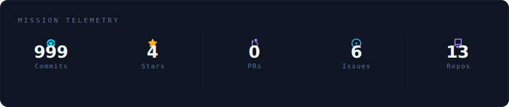

  

 

  

 

  

 

  

 

<strong>Mais sobre mim</strong>

 

Apaixonado por tecnologia e inovação, com experiência em desenvolvimento de software e engenharia de dados. 
Atualmente focado em criar soluções eficientes e escaláveis para desafios complexos. Sempre buscando aprender e crescer na área de tecnologia.

**Atualmente em** Engemap - Engenharia e Aerolevantamento — Assis, SP - Brasil

 

  
  

